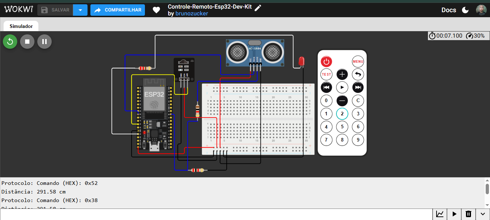

# 📡 Controle-Remoto-Esp32-Dev-Kit

Simulação de um sistema com controle remoto infravermelho e sensor ultrassônico, feita com a placa ESP32 DevKit no Wokwi.

---

## 📋 Sobre o projeto

A ideia foi receber comandos de um controle remoto infravermelho e mostrar o código de cada tecla no Monitor Serial. Cada vez que o microcontrolador recebe um comando, ele pisca um LED para indicar que a recepção funcionou e, em seguida, mede a distância até um objeto com o sensor ultrassônico HC-SR04, mostrando o valor em centímetros.

Esse projeto é a versão para ESP32 do meu controle remoto feito originalmente em Arduino Nano.

O projeto foi feito como parte do meu portfólio prático de sistemas embarcados, usando o Wokwi como ambiente de simulação.

▶️ [Abrir a simulação no Wokwi](https://wokwi.com/projects/476427503312488449)

---

## 🛠 Ferramentas utilizadas

- Wokwi (simulador)
- ESP32 DevKit
- Protoboard
- Receptor infravermelho (IR)
- Controle remoto IR
- Sensor ultrassônico HC-SR04
- 1 LED vermelho
- 1 resistor de 220 Ω
- 1 resistor de 1 kΩ
- 1 resistor de 2 kΩ
- Linguagem C++ (API do Arduino)
- Biblioteca IRremote

---

## 🏗 O que foi montado

O circuito tem três blocos principais:

- Receptor IR: alimentado com 5 V e GND pelos trilhos da protoboard, com o sinal de dados ligado ao pino 14 da placa.
- LED de aviso: ligado ao pino 13 com um resistor de 220 Ω em série e o outro lado no GND. Ele pisca sempre que um comando é recebido.
- Sensor ultrassônico HC-SR04: alimentado com 5 V e GND, com o TRIG ligado ao pino 25. O ECHO passa por um divisor de tensão (1 kΩ e 2 kΩ) antes de chegar ao pino 18.

O divisor de tensão reduz o sinal de 5 V do ECHO para cerca de 3,3 V, que é a tensão suportada pelos pinos da ESP32.

O Monitor Serial usa a porta serial da própria placa, então não precisa de nenhum componente extra para ver as mensagens.

### Pinagem

| Componente | Pino da ESP32 |
|---|---|
| Receptor IR (DAT) | 14 |
| LED vermelho (via resistor de 220 Ω) | 13 |
| Sensor ultrassônico (TRIG) | 25 |
| Sensor ultrassônico (ECHO, via divisor de tensão) | 18 |

---

## 🔧 Como funciona

1. A placa fica aguardando um sinal do receptor infravermelho.
2. Quando uma tecla do controle é pressionada, o código lê o comando e mostra o valor em hexadecimal no Monitor Serial.
3. O LED pisca por 50 ms para indicar que o comando foi recebido.
4. O pino TRIG envia um pulso de 10 µs para o sensor ultrassônico.
5. O código mede o tempo de retorno no pino ECHO e calcula a distância em centímetros.
6. A distância é mostrada no Monitor Serial.
7. O receptor fica pronto para o próximo comando.

---

## 💻 Código

```cpp
// Controle-Remoto-Esp32-Dev-Kit

#include <IRremote.h>

// Pino Digital 13 onde está o LED
#define PINO_LED 13

// Pino Digital 14 onde está o receptor IR
#define PINO_RECV 14

// Pino Digital 18 onde está o ECHO do sensor ultrassônico
#define PINO_ECHO 18

// Pino Digital 25 onde está o TRIG do sensor ultrassônico
#define PINO_TRIG 25

void setup() {
  Serial.begin(9600);

  // Inicializa o receptor IR no pino especificado
  IrReceiver.begin(PINO_RECV, ENABLE_LED_FEEDBACK);
  Serial.println("Receptor IR pronto. Aguardando comandos do controle...");

  // Define o pino do LED como saída
  pinMode(PINO_LED, OUTPUT);

  // Define o pino TRIG como saída
  pinMode(PINO_TRIG, OUTPUT);

  // Define o pino ECHO como entrada
  pinMode(PINO_ECHO, INPUT);
 
}

void loop() {
  if (IrReceiver.decode()) {

    // Verifica o protocolo detectado
    if (IrReceiver.decodedIRData.protocol) {
      Serial.print("Protocolo: ");
      Serial.print("Comando (HEX): 0x");
      Serial.println(IrReceiver.decodedIRData.command, HEX);
    } else {

      // Exibe outros protocolos caso o controle genérico do Wokwi envie algo diferente
      Serial.print("Outro protocolo - HEX: 0x");
      Serial.println(IrReceiver.decodedIRData.command, HEX);
    }
   
    // Pisca o LED para indicar recepção
    digitalWrite(PINO_LED, HIGH);
    delay(50);
    digitalWrite(PINO_LED, LOW);

    // Garante que o pino TRIG esteja inicialmente em nível baixo
    digitalWrite(PINO_TRIG, LOW);
    delayMicroseconds(10);

    // Envia o pulso de disparo para o sensor ultrassônico
    digitalWrite(PINO_TRIG, HIGH);
    delayMicroseconds(10);
    digitalWrite(PINO_TRIG, LOW);

    // Mede o tempo de retorno do sinal ultrassônico
    long duracao = pulseIn(PINO_ECHO, HIGH);

    // Calcula a distância em centímetros
    float distancia = duracao * 0.0343 / 2;

    // Exibe o valor da distância no Monitor Serial
    Serial.print("Distância: ");

    // Exibe o valor calculado da distância
    Serial.print(distancia);

    // Exibe a unidade de medida em centímetros
    Serial.println(" cm");

    // Prepara o receptor para receber o próximo sinal
    IrReceiver.resume();
  }
}
```

---

## 📸 Evidências do funcionamento

### Circuito montado e Monitor Serial
A imagem mostra a placa ESP32 DevKit, o receptor IR, o controle remoto, o sensor ultrassônico, o LED e os resistores, com o Monitor Serial exibindo os comandos recebidos e a distância medida.



---

## 📁 Arquivo do diagrama

O arquivo diagram.json com todas as peças e conexões está disponível no repositório e pode ser importado direto no Wokwi. Lembre de adicionar a biblioteca IRremote no projeto.

[📥 Download — diagram.json](diagram.json)

---

## 💡 O que aprendi com esse projeto

O principal foi ver como o mesmo código funciona em uma placa totalmente diferente. O programa do Nano foi reaproveitado quase inteiro, e o que mudou foram os números dos pinos (13, 14, 18 e 25 na ESP32).

Também aprendi que a ESP32 trabalha com 3,3 V nos pinos, enquanto o HC-SR04 entrega 5 V no ECHO. Por isso montei um divisor de tensão com resistores de 1 kΩ e 2 kΩ, que reduz o sinal para cerca de 3,3 V antes de chegar à placa.

---

## ⚠️ Sobre o projeto

Essa simulação é uma base para estudo. O código ainda não associa cada tecla a uma ação diferente, ele apenas mostra o comando recebido, pisca o LED e mede a distância. Uma evolução natural seria fazer cada botão acionar uma função, ou usar a distância medida para tomar decisões.

---

## 🚀 Próximos projetos

Outros projetos de sistemas embarcados serão postados em breve, com níveis de complexidade maiores.

---

## 👤 Autor: Bruno Zucker
